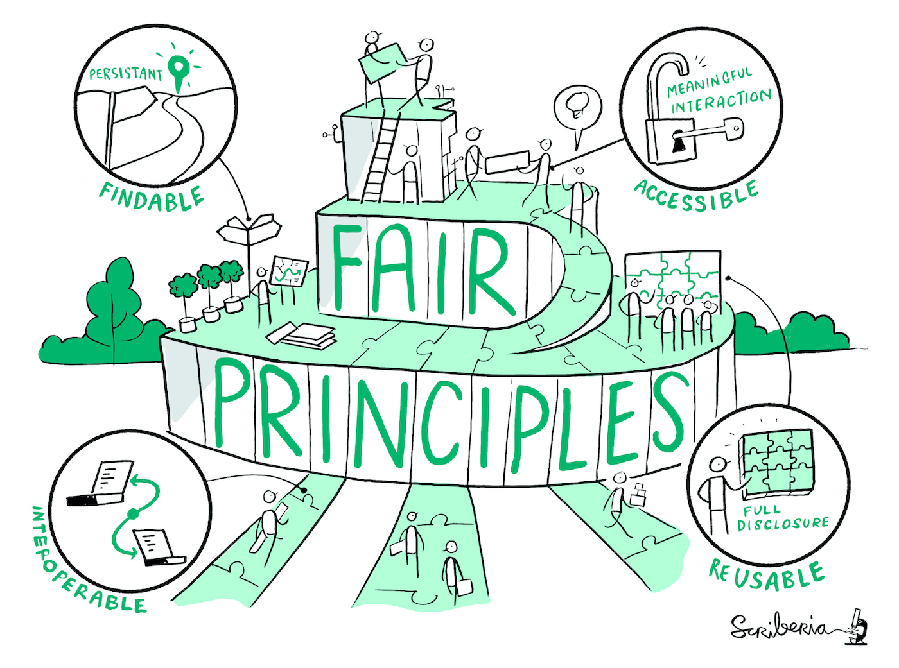

--- 
title: How to do open science in practice? 
subtitle: – CSC tools and services to support open science
author: Samantha Wittke
date: 06.05.22
lang: en
theme: csc-2016
---

# Aalto

https://www.aalto.fi/en/open-science-and-research/aalto-university-open-science-and-research-policy
https://libguides.aalto.fi/copyright/licensing-research-data-at-aalto

# Data / Code available on request

* own good / bad experiences?

# FAIR to the rescue

-> https://doi.org/10.5281/zenodo.3332807
 
F - indability
* persistant identifier
A - ccessability
* online link to the data and related metadata
* documented versioning and lifecycle
I - nteroperability
* open file formats and common standards
R - eusability
* rich metadata
* license

-> increasing impact and reliability of your work

# FAIR digital objects

-> https://data.europa.eu/doi/10.2777/1524

# FAIR != Open

"Data can be FAIR or Open, both or neither. The greatest benefits come when data are both FAIR and Open, as the
lack of restrictions supports the widest possible reuse, and reuse at scale." (https://data.europa.eu/doi/10.2777/1524)

# Research data management

Why? 
* good scientific practice, helps you and others
* required by funding bodies (eg AKA)
* merit, scientific credits

Aalto: publicly funded research has to be open , if possible

https://research.csc.fi/data-management?inheritRedirect=true

# Research data service considerations

* domain specific/organizational repository available?
* sensitive data?
* intended data usage?
* maintainer?
* interfaces needed?
* storage space needs? (individual size?)
* automated file transfer?
* metadata needs?
* security needs?

see also: https://docs.csc.fi/data/datasets/hosting-datasets-at-CSC/#what-to-consider-when-choosing-a-suitable-storage-solution

https://docs.csc.fi/data/datasets/publishing-datasets/

# Good repository?

* Established
* Good metadata
* Curation and preservation
* Open and machine readable
* Registry of Research Data Repositories: re3data.org ; https://fairsharing.org/ ; ...

# How to find good repository?

1. Look for the Core trust seal and how the service looks like
2. Can you search, find and evaluate data from the repository yourself?
3. Would and could you use it yourself?

-> re3data.org

# CSC services

https://research.csc.fi/storage-comparison-table
https://research.csc.fi/open-and-discover

# FAIRdata services

store - describe - search 

(latter part of research data life cycle)

* Smooth transition between the separate services
    * Single sign-in to the services
    * Descriptive metadata passage between services

* Available (METAX)
    * Storage service IDA
    * Metadata tool Qvain
    * Finder/Viewer Etsin
    * Digital preservation service Fairdata PAS

specifically well suited for large storage, free with limitations

# IDA

Saving, organising, sharing and storing data

* stable research data, 
* both raw data and processed data, 
* free of charge to users affiliated with Finnish universities and polytechnics, Finnish research institutes and research funded by the Academy of Finland.

* staging -> freezing area

https://docs.csc.fi/data/datasets/hosting-datasets-at-CSC/
https://www.fairdata.fi/en/ida/

480TB for Aalto; login with Aalto HAKA

browser + CLI
cumulative dataset possible

# Limitations

IDA not suitable for 
* sensitive personal or confidential data -> Sensitive data services
* data under heavy usage -> Allas (Paituli??)

# Qvain

https://www.fairdata.fi/en/qvain/qvain-user-guide/

Metadata
description

Create(s) a descriptive metadata for research datasets to 
improve their finadbility

-> describe and publish with the Qvain tool
-> who has produced the data, its topic, keywords and licenses

data public; "embargo" (data public for certain time); data public for logged in users (HAKA/CSC), non-public (needs reason)

# Etsin

PID and landing page
For searching research data and their descriptive metadata from the Fairdata service
ensurance that metadata is available even if data is no longer

# Digital preservation

reliable preservation

Preservation of digital information for several decades or centuries, even though hardware, 
software and file formats become outdated

10TB for Aalto

# Paituli

* spatial data download service
* Paituli is open to anyone 
* also includes historical versions of datasets
* you can publish own geospatial datasets
* unrestricted access

* number of users/ downloads

-> all data also directly available on Puhti

# Paituli access

OGC: WMS (maps, map image for viewing), WMTS (maptiles, map image tiles for viewing), WFS (features; vector data), WCS (coverage, raster data)

https://paituli.csc.fi/webservices.html

http, ftp, rsync (https://paituli.csc.fi/ftprsync.html)

# Data formats Paituli

raster: COG
vector: GPKG/SHP
pointcloud: LAZ
multidimensional: netcdf,zarr

# Publishing data on Paituli

1. Make sure the data can be published. 
2. Describe the data. The data description should include:
3. Package your data, technical recommendations
4. Send the data and its description to giscoord@csc.fi.
5. CSC will publish your data to Paituli in a week or two.

# Sensitive Data Services for research

https://docs.csc.fi/data/sensitive-data/

[What is sensitive data?](https://research.csc.fi/definition-of-sensitive-data)

Simple to use web-user interfaces which provide a secure workspace and facilitate sensitive data management. 

SD Connect: store and share sensitive research data during the active phase of a research project; built on Allas; storage in Finland

SD Desktop: compute; decryption on the fly; built on ePouta; provides an isolated, secure private cloud computing environment accessible via a web user interface. All data processing takes place in Finland

SD Submit: publish under controlled access (pilot phase)

SD Apply: re-use (pilot phase)

Designed to support collaborative projects, on demand, available from the public internet.

https://research.csc.fi/sensitive-data-services-for-research

# Other

B2Share (EUDAT) - currently only guaranteed for 2 years, 20 GB limit for one dataset, 10 GB per file -> more needs premium access, which Aalto does not have

# How to choose?

1. sensitive data? -> SD services
2. domain specific repository?
3. dataset size & cost
4. connection to home organization and research.fi

# Licensing

Aalto : As open as possible, as closed as necessary’ - https://www.aalto.fi/en/open-science-and-research/aalto-university-open-science-and-research-policy

-> Aalto: Data: CC BY 4.0 for protocols, MIT for code

CC BY 4.0 (or later, not earlier, not valid for data!)
-> attribution (licensor must be given credit)
(-SA: share-alike; -ND: non derivative; -NC: non commercial)

-> irrevocable! All authors must agree, no restrictions may be added

Data: https://creativecommons.org/

CC0 serves as a public dedication mechanism, where you relinquish all copyrights to your data. 

# Data formats

 
# Code

git* -> Zenodo

FAIR

https://coderefinery.github.io/social-coding/

https://www.rd-alliance.org/group/fair-research-software-fair4rs-wg/outcomes/fair-principles-research-software-fair4rs

Licensing: https://choosealicense.com/ https://coderefinery.github.io/social-coding/

# Workflow

scripting helps
workflow tools / bash scripts
environment - virtual environments / containers with recipes

ie moving to Puhti gives you a headstart

Reproducible
https://coderefinery.github.io/reproducible-research/

# Publication

-> preprint:arXiv, postprint ACRIS

# What can I do right now?

#from https://www.fairdata.fi/en/about-fairdata/benefits/

* Research plan /RDM - keep up to date
* document each dataset 
* think about future storage
* get PID for dataset and use it
* use services that support FAIR principles

* clear file naming
* version control (git LFS, git-annex, datalad)

* code == documentation of process
* document software environment

* keep original data + codes/notes on process
* large process -> also keep/publish results

https://how-to-open.science/change/educate/first-steps/
https://the-turing-way.netlify.app/reproducible-research/open/open-checklist.html

# Resources

https://avointiede.fi
https://the-turing-way.netlify.app/index.html
https://fairsharing.org/
https://www.software.ac.uk/how-can-you-make-research-data-accessible
https://www.openaire.eu/research-data-how-to-license/
https://www.rd-alliance.org/system/files/FAIR4RS_Principles_v0.3_RDA-RFC.pdf

# CSC

* non-profit state enterprise with special tasks
* owned by Finnish state (70%) and higher education institutions (30%)
* headquaters in Keilaniemi, Espoo
* side offices and supercomputers in Kajaani

# CSC services

[`research.csc.fi/en/service-catalog`](https://research.csc.fi/en/service-catalog)

**Compute & Analyze**

  - cPouta / ePouta
  - Puhti / Mahti / LUMI
  - Notebooks

**Store, Share & Publish Data**

  * Allas
  * FAIRDATA
  * SD services
  * Paituli

# CSC - Puhti

* webinterface
* parallel computing
* CPU, GPU, memory

# CSC - Cloud

* Pouta
    * own virtual machines
    * webservice
    * databases
* Notebooks
    * university courses
    * self-learning
    * collaboration
* Rahti - container cloud

# CSC - Data

* short term 
* medium term
* long term
* geospatial

- Allas; also direct access without download

# CSC - Expertise

...at your fingertips:

[`docs.csc.fi`](https://docs.csc.fi)

[`research.csc.fi`](https://research.csc.fi)

**\+ servicedesk@csc.fi**
* Geoinformatics team
* Storage team
* Supercomputer team
* Cloudcomputing team
* Accounts team
* ...

# Training

* ['Using CSC environment efficiently' self-learning course](https://csc-training.github.io/csc-env-eff/)
* [16.05: Hybrid Earth Observation workshop](https://ssl.eventilla.com/event/zArJA)
* [09.+10.05: Geoinformatics Research Days + CSC workshop on Tue](https://www.geoportti.fi/geoinformatics-research-days-2022/)
* [18.05: Webinar - CSC´s generic services for storing, sharing and publishing data](https://ssl.eventilla.com/event/pEAl3)
* [23.05: Webinar - Digitaalisen tutkimusaineiston säilytys Fairdata PAS-palvelussa](https://ssl.eventilla.com/event/Q2zRM)
* [CSC geoinformatics training material](https://research.csc.fi/gis-learning-materials)

-> follow our [training calendar](https://www.csc.fi/en/training#training-calendar)