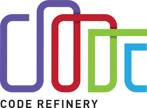

--- 
title: How to do open science in practice? 
subtitle: – CSC tools and services to support open science
author: Samantha Wittke
date: 06.05.22
lang: en
theme: csc-2019
---

# Data / Code "available on request"

* own good / bad experiences?

# FAIR to the rescue!

# FAIR digital objects

# FAIR != Open

"Data can be FAIR or Open, both or neither. The greatest benefits come when data are both FAIR and Open, as the lack of restrictions supports the widest possible reuse, and reuse at scale." (https://data.europa.eu/doi/10.2777/1524)

#  

# -> Research data management

* good scientific practice
* helps you and others
* required by funding bodies (eg AKA)
* merit, scientific credits
* comply with FAIR principles
* agree on data ownership and sharing early on
* ensure needed resources: storage, computing environment, equipment etc.

# Research data service considerations

  

* sensibility of publishing dataset?
* sensitive data?
* domain specific repository available?
* intended data usage?
* maintainer?
* interfaces needed?

* storage space needs? 
* file transfer needs?
* metadata needs?
* security needs?
* data type 

# Data repositories

  

**Find yours:**

* [re3data.org](https://re3data.org) 
* [fairsharing.org](https://fairsharing.org/)
* [Nature recommendations](https://www.nature.com/sdata/policies/repositories)

**Check for:**

* Well established
* Good metadata
* Curation and preservation
* Open and machine readable

# Potentially interesting repositories

* **Avoindata.fi**, no PID, free, open license
* **Pangaea**, DOI, max 10GB, free (500€ if possible), open license, earth and life sciences, reviewed
* **Zenodo**, DOI, max 50 GB, free, any license, also non-open datasets
* **GFZ Data Services**, DOI, free, open license, earth and environmental sciences
* **Dryad**, DOI, max 300GB, 120+$, CCO, reviewed

# FAIRdata services

# FAIRdata benefits

* Smooth transition between separate services

    * Single sign-in
    * Descriptive metadata passage 

* specifically well suited for large storage 
* free (with limitations)

# Saving, organising, sharing and storing data with IDA

* stable research data
* during project lifetime and after
* both raw data and processed data
* web and command line interface
* possibility to collect cumulative data 
* possibility to "stage before freeze"

# Metadata description with Qvain

-> data description, producer, topic, keywords and licenses
  

* assignes PID (URI (non-static) or DOI)
* choose access
  * data public
  * "embargo" (data public for certain time)
  * data public for logged-in users (HAKA/CSC)
  * non-public

# Etsin - Fairdatas search 'engine'

* landing page

-> ensurance that metadata is available even if data is no longer

# Publishing data with Fairdata

1. Create a CSC user account
2. (IDA: Create a project and apply (from Aalto) for IDA storage space) 
3. (Add members to your project)
4. (IDA: Store your data and freeze it)
5. Qvain: create a dataset/metadata and publish it
6. Etsin: view your published dataset

# Digital preservation service
(Pitkäaikaissäilytys (PAS))

"Preservation of digital information for several decades or centuries, even though hardware, software and file formats become outdated" 

  

-> Geoportti project: Definition of spatial data format 

# Paituli

* spatial data download service
* open to anyone, unrestricted access
* includes historical versions of datasets
* publish own geospatial datasets -> URN
* webbased data preview
* not limited to Finland
* annual usage reports

# Paituli data

~ 13 TB data

2021

* 2615 users
* 10k downloads from web
* \> 1mio API requests

-> almost all data also on Puhti

# Paituli access

**OGC webservices:**

* WMS (maps, map image for viewing)
* WMTS (maptiles, map image tiles for viewing)
* WFS (features; vector data)
* WCS (coverage, raster data

**Download:**

* webinterface,
* bulk download: http, ftp, rsync

# Preferred data formats

* raster: COG
* vector: GPKG/SHP
* pointcloud: LAZ
* multidimensional: netcdf, zarr

# Publishing data on Paituli

1. Make sure the data can be published
2. Describe the data
3. Package your data
4. Send the data and its description to giscoord@csc.fi
5. CSC will publish your data to Paituli in a week or two

# Sensitive Data Services

"Secure workspace for all phases of research"

  

* webinterface 
* on-demand
* data-controller
* always encrypted

* **SD Connect**: store and share sensitive research data during the active phase of a research project
* **SD Desktop**: isolated, secure private cloud computing environment accessible via web interface; extendable software stack
* **SD Submit**: publish under controlled access (pilot phase)
* **SD Apply**: re-use (pilot phase)

# Allas

* Object storage
* Project-lifetime storage
* Connected with other services
* Accessible also from own computer
* CSC account and project required
* Maximum size for free: **200TB**

# EUDAT services

* open for all
* 20 GB limit for dataset
* 10 GB per file
* currently only guaranteed for 2 years
* customizable (premium access)

# How to choose?

1. sensitive data? -> SD services
2. domain specific repository? 
3. availability timeframe?
4. dataset size & cost?
5. access needs?
6. ease of publishing process
7. connection to home organization and research.fi

# Licensing

CC BY **4.0** (or later; not earlier, not valid for data!)

-> attribution (licensor must be given credit)

(-SA: share-alike; -ND: non derivative; -NC: non commercial)

-> irrevocable! All authors must agree, no restrictions may be added

**CC0**: relinquish all copyrights to your data (-> Metadata could be CC0)
 
# FAIR software practices

  

* Version control
* Accessible documentation
* License, e.g. MIT
* DOI from e.g. Zenodo
* Recording environments

# Actions

  

Start early - limit workload

But it is (almost) never too late!

# What can I do right now?

* RDM plan - keep up to date
* document everything (metadata, code)
* current and future storage
* (get PID (DOI, immutable!) for dataset and use it)
* use services that support FAIR principles

* clear file naming
* version control (git LFS, git-annex, datalad)
* keep original data separate
* publish metadata (with or without data attached)
* backups

#  

# Resources

* [avointiede.fi](https://avointiede.fi)
* [reseach.fi](https://research.fi)
* [Turing way](https://the-turing-way.netlify.app/index.html)
* [Fairsharing](https://fairsharing.org/)
* [Tips for accessible research data](https://www.software.ac.uk/how-can-you-make-research-data-accessible)
* [Tips for licensing research data](https://www.openaire.eu/research-data-how-to-license/)
* [Research Data Alliance](https://www.rd-alliance.org)
* [Licensing software](https://choosealicense.com/)

* [CodeRefinery material - FAIR software practices](https://coderefinery.org/lessons/)
* [CSC storage comparison](https://research.csc.fi/storage-comparison-table) 
* [CSC docs - data](https://docs.csc.fi/data/datasets/dataset-sources/)
* [CSC Fairdata services](https://www.fairdata.fi)
* [EUDATservices](https://research.csc.fi/-/eudat-services)
* [CSC Sensitive data](https://research.csc.fi/sensitive-data-services-for-research)

# CSC

* non-profit state enterprise with special tasks
* owned by Finnish state (70%) and higher education institutions (30%)
* headquaters in Keilaniemi, Espoo
* side offices and supercomputers in Kajaani

# CSC services

[`research.csc.fi/en/service-catalog`](https://research.csc.fi/en/service-catalog)

**Compute & Analyze**

  - cPouta / ePouta
  - Puhti / Mahti / LUMI
  - Notebooks
  - Rahti

**Store, Share & Publish Data**

  * Allas
  * Fairdata and PAS
  * SD services
  * Paituli

# CSC - Puhti

* parallel computing
* large software stack
* CPU, GPU, memory
* webinterface

# CSC - Cloud

* Pouta
    * own virtual machines
    * webservice
    * databases
* Notebooks
    * university courses
    * self-learning
    * collaboration
* Rahti - container cloud

# CSC - Data

* short term -> Allas, Puhti
* medium term -> Allas, IDA
* long term -> IDA, PAS
* geospatial -> Paituli

# CSC - Expertise

...at your fingertips:

  
[docs.csc.fi](https://docs.csc.fi)
  
[research.csc.fi](https://research.csc.fi)
  

**\+ servicedesk@csc.fi**

* Geoinformatics team
* Storage team
* Supercomputer team
* Cloudcomputing team
* Accounts team
* AI & data analysis team
* ...

# Training

* ['Using CSC environment efficiently' self-learning course](https://csc-training.github.io/csc-env-eff/)
* [16.05: Hybrid Earth Observation workshop](https://ssl.eventilla.com/event/zArJA)
* [09.+10.05: Geoinformatics Research Days + CSC workshop on Tue](https://www.geoportti.fi/geoinformatics-research-days-2022/)
* [18.05: Webinar - CSC´s generic services for storing, sharing and publishing data](https://ssl.eventilla.com/event/pEAl3)
* [23.05: Webinar - Digitaalisen tutkimusaineiston säilytys Fairdata PAS-palvelussa](https://ssl.eventilla.com/event/Q2zRM)
* [CSC geoinformatics training material](https://research.csc.fi/gis-learning-materials)

-> follow our [training calendar](https://www.csc.fi/en/training#training-calendar)

# Figures

* FAIR: -> https://doi.org/10.5281/zenodo.3332807
* FAIR object: -> https://data.europa.eu/doi/10.2777/1524
* other Figures: CSC