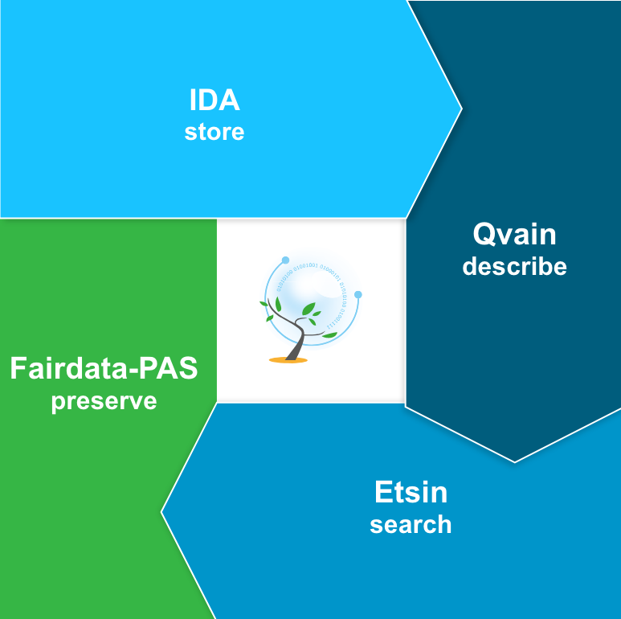

find responsible person: https://wiki.eduuni.fi/pages/viewpage.action?pageId=192550570 

# Aalto

https://www.aalto.fi/en/open-science-and-research/aalto-university-open-science-and-research-policy
https://libguides.aalto.fi/copyright/licensing-research-data-at-aalto

# FAIR to the rescue

F - indability
* persistant identifier
A - ccessability
* online link to the data and related metadata
* documented versioning and lifecycle
I - nteroperability
* open file formats and common standards
R - eusability
* rich metadata
* license

-> increasing impact and reliability of your work

data and code!

FAIRDATA services: OKM service, CSC maintains

IDA: 480TB for Aalto; login with Aalto HAKA

Digital preservation: 10TB for Aalto

paituli: CSC service
OKM supports maintaining it

# Data formats

# Workflow

scripting helps
workflow tools / bash scripts
environment - virtual environments / containers with recipes

ie moving to Puhti gives you a headstart

Reproducible
https://coderefinery.github.io/reproducible-research/

tykky

# Publication

-> preprint:arXiv, postprint ACRIS